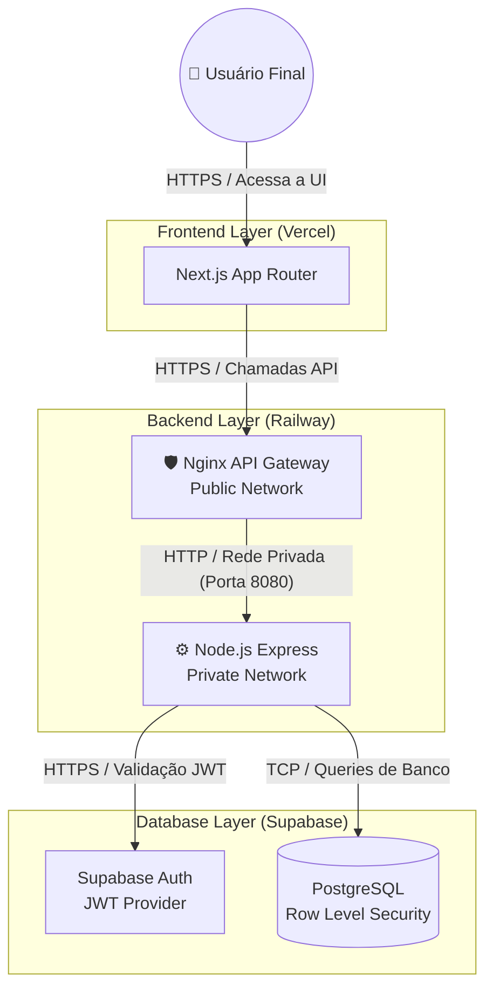
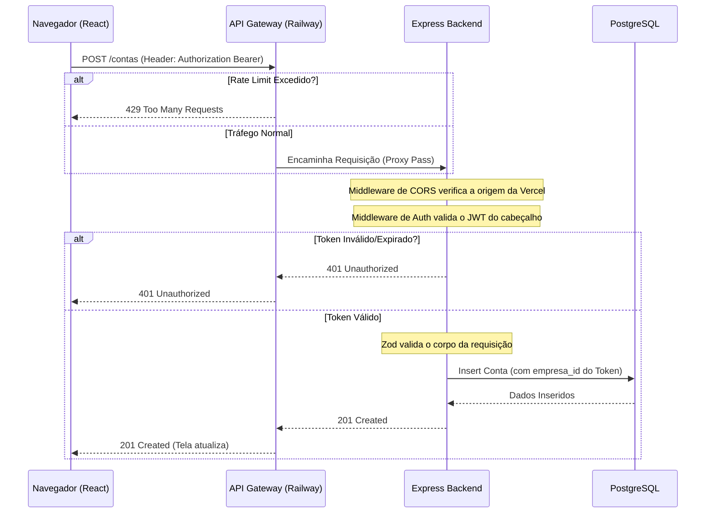

# Arquitetura de Sistemas (System Design)

A arquitetura do ContaUp foi desenhada para isolar responsabilidades e garantir que o núcleo do sistema (Node.js e Supabase) fique totalmente protegido do tráfego sujo da internet.

## 1. Topologia de Nuvem (Cloud Topology)
Abaixo está o diagrama de como os serviços estão distribuídos fisicamente em diferentes provedores de nuvem (Vercel e Railway).

## 2. Padrão API Gateway
A aplicação não permite que o frontend se comunique diretamente com o Node.js. 
Todas as requisições oriundas do Next.js batem primeiramente no **Nginx**.

### Por que usar Nginx como Gateway?
1. **Segurança de Borda**: O Nginx descarta requisições maliciosas e conexões lentas (Slowloris attack) antes que elas gastem CPU do Node.js.
2. **Isolamento de Rede**: O Node.js não possui um IP público. Se o Nginx cair, a porta principal se fecha, mas o Node.js não pode ser acessado diretamente por invasores escaneando portas na internet.

## 3. O Fluxo de Vida de uma Requisição
Veja exatamente o que acontece quando um usuário clica no botão "Salvar Conta a Pagar":

Este desacoplamento permite que, no futuro, possamos adicionar novos microserviços (ex: Serviço de Relatórios em Python) e apenas configurarmos uma nova rota no Nginx (`/relatorios`) sem precisarmos mexer no Node.js principal.
