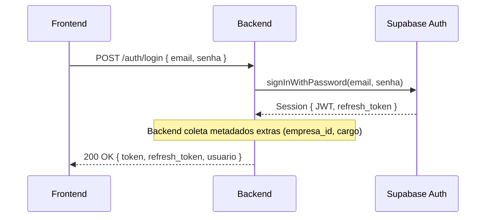

# Autenticação e Autorização (JWT)

O sistema baseia-se num fluxo stateless com tokens JWT.
Em vez de gerenciar sessões, a aplicação Frontend guarda um token assinado (via cookies ou memory/storage) e o envia a cada requisição.

## 1. O Fluxo de Login

## 2. A Proteção das Rotas
Para as rotas seguras (ex: `/contas`, `/balancos`), o Backend emprega o `authMiddleware`.
Este middleware realiza:
1. Extração do token do cabeçalho `Authorization: Bearer <token>`.
2. Verificação criptográfica de assinatura (usando os segredos do Supabase).
3. Injeção dos dados do usuário logado (ex: `empresa_id`) diretamente no objeto `req` do Express.

## 3. Isolamento Multitenant (B2B)
Como o sistema atende várias empresas ao mesmo tempo, é vital que a "Empresa A" nunca consiga ver ou apagar os lançamentos da "Empresa B".
- **Garantia de Identidade**: O Frontend não pode "mandar" qual é a sua empresa. O Backend **ignora** qualquer tentativa de injetar `empresa_id` pelo body da requisição.
- A única fonte da verdade é o Token JWT assinado. O controlador pega o `req.usuario.empresaId` (retirado de dentro do Token) e o usa como filtro OBRIGATÓRIO no banco de dados.
